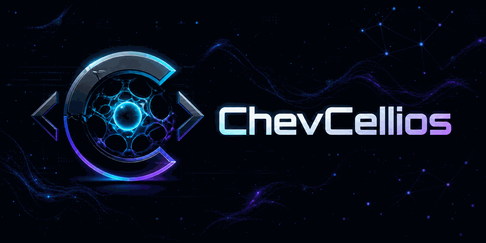

<p align="center">
  
</p>

<h1 align="center">Welcome to my GitHub :)👋</h1>

<p align="center">
  <strong>Developer · Builder · Digital Explorer</strong><br />
  I turn ideas into useful software, visual systems, and practical experiments.
</p>

<p align="center">
  <a href="https://github.com/ChevCellios?tab=repositories">
    
  </a>
  <a href="https://github.com/ChevCellios?tab=stars">
    
  </a>
</p>

---

## Welcome to my digital workshop

This profile is a living map of the things I build, learn, test, break, and improve. I am most interested in the space where **software engineering**, **creative technology**, **automation**, and **visual thinking** meet.

Some repositories are finished tools. Others are prototypes, notes, or small ideas that may grow into something larger. I keep the process visible because progress is often more useful than polish.

> **Build clearly. Learn continuously. Leave the system better than you found it.**

## What I build

| Focus | What it means in practice |
| --- | --- |
| **Software systems** | Small, focused applications with clear boundaries and maintainable code |
| **Web experiences** | Responsive, accessible interfaces that feel intentional |
| **Automation** | Repeatable workflows that remove friction without hiding complexity |
| **AI-assisted development** | Research, prototyping, review, and iteration grounded in human judgment |
| **Visual systems** | Interfaces, diagrams, and assets that make technical ideas easier to understand |

## Featured work

My repositories currently span a few recurring themes:

- **Applications** — complete tools, utilities, and product experiments
- **Web** — websites, interfaces, components, and frontend explorations
- **Automation** — scripts, integrations, and repeatable workflows
- **Visual Lab** — brand assets, UI concepts, and creative technology
- **Learning** — technical investigations, exercises, notes, and prototypes

<p align="center">
  <a href="https://github.com/ChevCellios?tab=repositories"><strong>Browse all repositories →</strong></a>
</p>

<!--
Add real projects here when they are ready:

### Project name

One sentence explaining the problem and why the project exists.

- **Status:** Active / Stable / Experimental / Archived
- **Built with:** Technology list
- **Highlights:** Most important capabilities
- **Repository:** https://github.com/ChevCellios/REPOSITORY
- **Demo:** Optional live URL
-->

## Technology and tools

I choose tools for the problem, not for fashion. These are the technologies and environments I use or actively explore:

<p align="center">
  <a href="https://skillicons.dev">
    
  </a>
</p>

Beyond the stack, I care about maintainable architecture, responsive UI, APIs and integrations, testing, documentation, and visual consistency.

## How I work

```text
Understand the real problem
        ↓
Define the smallest useful outcome
        ↓
Build a working vertical slice
        ↓
Test with realistic inputs
        ↓
Refine the structure and experience
        ↓
Ship, observe, and iterate
```

My working principles are simple:

1. **Clarity before complexity** — more code cannot fix a vague goal.
2. **Working software before abstraction** — architecture should emerge from real needs.
3. **Verification before confidence** — tests, inspection, and evidence matter.
4. **Documentation is part of the product** — future contributors need context, not clues.
5. **Iteration over perfection** — a useful version today creates better feedback tomorrow.
6. **Preserve user control** — automation should remain understandable and reversible.

## Current direction

- building a consistent identity across my GitHub work;
- turning promising experiments into focused, reusable tools;
- documenting projects so their purpose and status are immediately clear;
- adding live demos and deeper technical write-ups where they add value;
- contributing more reusable work back to the open-source community.

---

### GitHub Activity

<p align="center">
  

  
</p>

<p align="center">
  
</p>

---

<p align="center">
  Building • Learning • Improving
</p>
<p align="center">
  <sub>Statistics reflect public GitHub activity and may not represent private or external projects.</sub>
</p>

## Let's collaborate

I am open to conversations about developer tools, focused web products, workflow automation, open-source experiments, creative coding, and projects where solid engineering and strong presentation reinforce each other.

If one of my repositories is useful to you, open an issue, start a discussion, or propose an improvement. A clear description of the problem and the desired outcome is always the best place to begin.

---

<p align="center">
  <strong>Thanks for visiting.</strong><br />
  Explore the repositories, follow the experiments, or return later — the map will keep growing.
</p>

<p align="center">
  <a href="https://github.com/ChevCellios">Profile</a>
  ·
  <a href="https://github.com/ChevCellios?tab=repositories">Repositories</a>
  ·
  <a href="https://github.com/ChevCellios?tab=stars">Stars</a>
</p>

<p align="center"><sub>Designed and maintained by ChevCellios.</sub></p>
