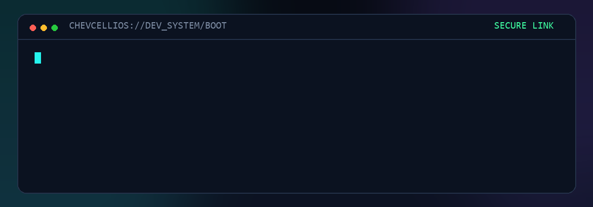
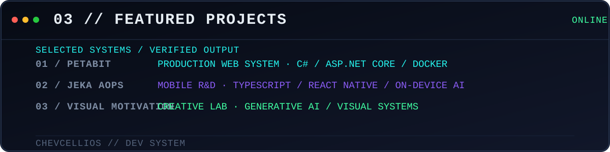
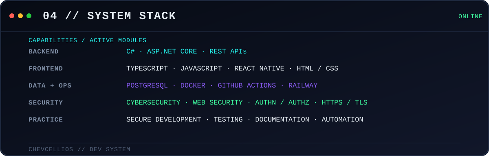
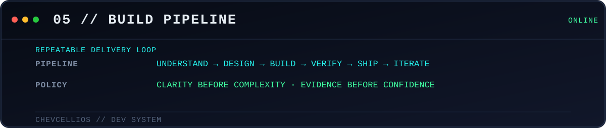

---

## `01 // SYSTEM BOOT`

`BOOT COMPLETE` · `IDENTITY VERIFIED` · `SYSTEM ONLINE`

## `02 // WHOAMI`

I build focused applications, secure web systems, automation, and visual experiments. My work lives where **software engineering**, **cybersecurity**, **AI-assisted development**, and **creative technology** intersect.

> `whoami` — Developer / builder / digital explorer turning complex ideas into clear, useful systems.

## `03 // FEATURED PROJECTS`

## `04 // SYSTEM STACK / SKILLS`

C# · .NET · TypeScript · JavaScript · HTML · CSS · React · Node.js · Python · PostgreSQL · Docker · Git · GitHub · VS Code

## `05 // WORKFLOW`

## `06 // GITHUB ACTIVITY`

<code>OPEN DETAILED TELEMETRY</code>

 

## `07 // SYSTEM PHILOSOPHY`

### `> CORE DIRECTIVE`

**Build clearly. Learn continuously.** 
**Leave the system better than you found it.**

`EOF // CHEVCELLIOS`

