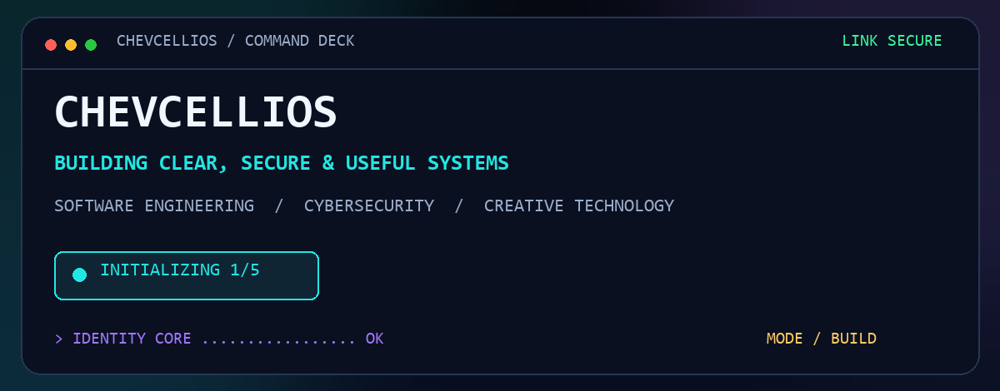
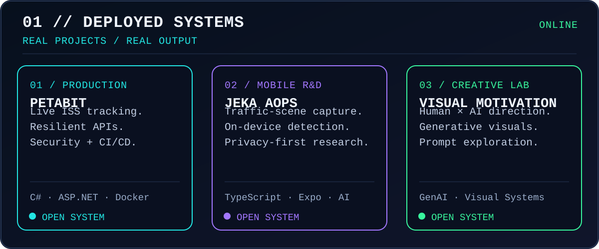
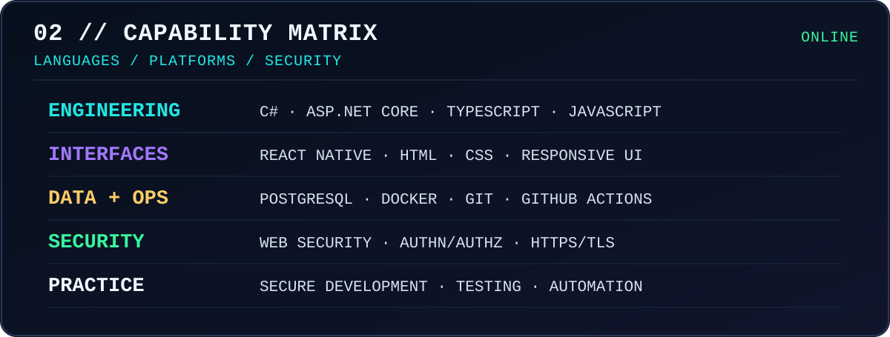
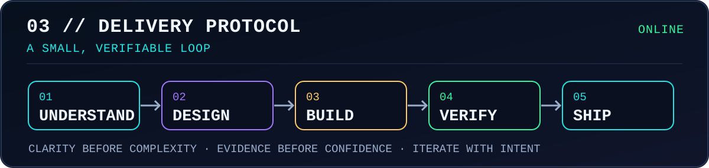

### `SOFTWARE ENGINEERING` · `CYBERSECURITY` · `CREATIVE TECHNOLOGY`

## `> OPERATOR PROFILE`

Developer building focused applications, secure web systems, automation, and visual experiments. I turn complex ideas into software that is clear, useful, tested, and maintainable.

### `BUILD CLEARLY · LEARN CONTINUOUSLY · LEAVE THE SYSTEM BETTER`

